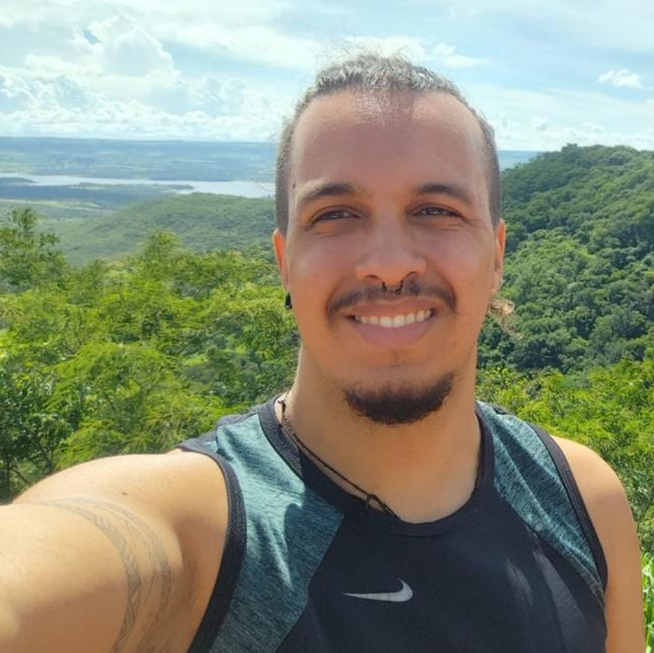

---
hide:
  - navigation
  - toc
---

# Marcio de Souza | Physicist, PhD

## Who am I?
{ width=550, align=left}

Olá! My name is Marcio de Souza, a postdoctoral and machine learning researcher at [SPRACE](https://sprace.org.br/){:target="_blank"}, working within [CMS](goto:https://cms.cern/){:target="_blank"} collaboration. I earned my PhD from the Federal University of Rio Grande do Sul [(UFRGS)](https://if.ufrgs.br/ppgfis/){:target="_blank"} and my undergraduate degree from the Federal University of Uberlândia [(UFU)](https://www.infis.ufu.br/){:target="_blank"}. I'm also a data scientist and a former elementary school physics teacher.

My research involves using experimental data and computer simulations to search for new physics beyond the Standard Model. I'm particularly interested in the problem of dark matter and how we can explain the data from the [Large Hadron Collider (LHC)](https://home.cern/){:target="_blank"} and its correlation with other cosmological observations.

On this page, you'll find links to my main work, other projects I'm involved in, and also presentations, code, and outreach materials I'm working on. If you'd like to get in touch or know more about my work, feel free to [email me](mailto:marcio.souza@cern.ch) or use one of the following links.

- :material-email: __[marcio.souza@cern.ch](mailto:marcio.souza@cern.ch){:target="_blank"}__
- :fontawesome-brands-linkedin: __[LinkedIn](https://www.linkedin.com/in/marcio-d-souza/){:target="_blank"}__
- :fontawesome-brands-github: __[GitHub](https://github.com/mardsouza){:target="_blank"}__
- :simple-readdotcv: __[Lattes CV](http://lattes.cnpq.br/1439394666706075){:target="_blank"}__
- :fontawesome-brands-orcid: __[ORCID](https://orcid.org/0000-0003-4044-1735){:target="_blank"}__
- :fontawesome-brands-google-scholar: __[Google Scholar](https://scholar.google.com/citations?user=WgAnD1YAAAAJ){:target="_blank"}__

---
