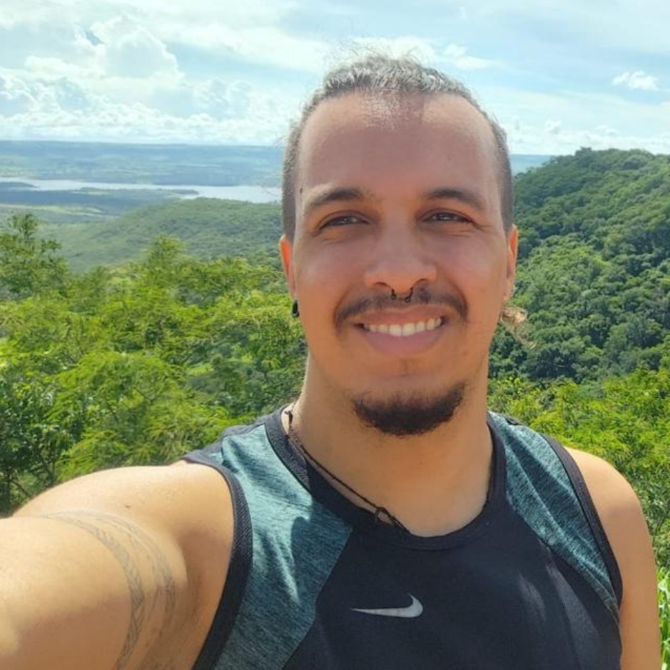

---
hide:
  - navigation
  - toc
---

# [Marcio de Souza | Doutor em Física](https://bckl.gg/oed7)

## Quem sou eu?
{ width=550, align=left}

Olá! Meu nome é Marcio de Souza, sou físico e atualmente estou atuando como pesquisador de pós-doutorado no [SPRACE](https://sprace.org.br/){:target="_blank"}, trabalhando dentro da colaboração [CMS](goto:https://cms.cern/){:target="_blank"}, experimento do Grande Colisor de Hádrons (LHC), do CERN, que fica na fronteira da Suiça com a França. Eu defendi meu doutorado pela Universidade Federal do Rio Grande do [(UFRGS)](https://if.ufrgs.br/ppgfis/){:target="_blank"} e fiz minha graduação em física pela Universidade Federal de Uberlândia [(UFU)](https://www.infis.ufu.br/){:target="_blank"}. Também já trabalhei como cientista de dados e como professor de física na educação básica.

Minha pesquisa envolve usar dados experimentais e simulações computacionais para procurar por nova física, além daquela descrita pelo [Modelo Padrão das Partículas Elementares](https://pt.wikipedia.org/wiki/Modelo_Padr%C3%A3o){:target="_blank"}. Eu estou particularmente interessado no problema da matéria escura e como podemos explicar e correlacionar os dados do Grande Colisor de Hádrons [ou *Large Hadron Collider* (LHC)](https://home.cern/){:target="_blank"} com outras observações cosmológicas e astrofísicas.

Nessa página, você encontrará alguns links pro meu trabalho, projetos que estou envolvido, assim como apresentações, códigos e materiais de divulgação científica em que estou trabalhando atualmente. Caso deseje entrar em contato, ou saber mais sobre o meu trabalho, fique a vontade para me mandar um [e-mail](mailto:marcio.souza@cern.ch) ou usar algum dos links abaixo:

- :material-email: __[marcio.souza@cern.ch](mailto:marcio.souza@cern.ch){:target="_blank"}__
- :fontawesome-brands-linkedin: __[LinkedIn](https://www.linkedin.com/in/marcio-d-souza/){:target="_blank"}__
- :fontawesome-brands-github: __[GitHub](https://github.com/mardsouza){:target="_blank"}__
- :simple-readdotcv: __[Currículo Lattes](http://lattes.cnpq.br/1439394666706075){:target="_blank"}__
- :fontawesome-brands-orcid: __[ORCID](https://orcid.org/0000-0003-4044-1735){:target="_blank"}__
- :fontawesome-brands-google-scholar: __[Google Scholar](https://scholar.google.com/citations?user=WgAnD1YAAAAJ){:target="_blank"}__

---
